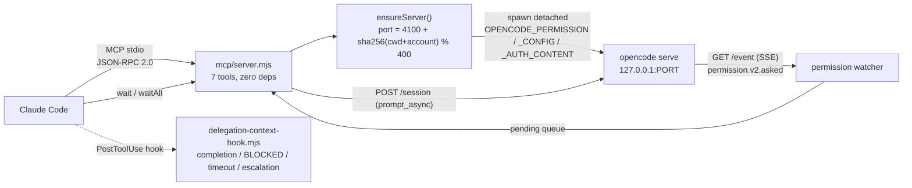
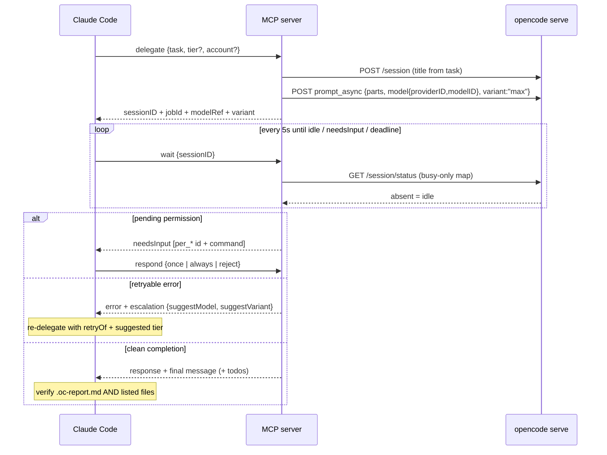
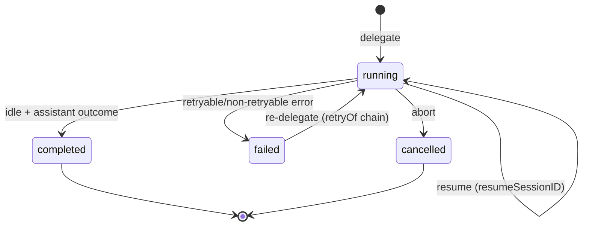

# OpenCode plugin for Claude Code

[](https://github.com/naicud/opencode-plugin-cc/actions/workflows/test.yml)


> **Tribute**: This project is inspired by and pays homage to
> [codex-plugin-cc](https://github.com/openai/codex-plugin-cc) by OpenAI.
> The plugin architecture, command structure, and design patterns are derived from
> the original codex-plugin-cc project, adapted to work with
> [OpenCode](https://github.com/anomalyco/opencode) instead of Codex.

Use OpenCode from inside Claude Code for code reviews or to delegate tasks.

This plugin is for Claude Code users who want an easy way to start using OpenCode from the workflow
they already have.

## What You Get

- `/opencode:review` for a normal read-only OpenCode review
- `/opencode:adversarial-review` for a steerable challenge review
- `/opencode:rescue`, `/opencode:status`, `/opencode:result`, and `/opencode:cancel` to delegate work and manage background jobs
- `/opencode:delegate` plus **nine MCP tools** (`models`, `delegate`, `wait`, `waitAll`, `status`, `respond`, `abort`, `shutdown`, `doctor`) reachable as `mcp__plugin_opencode_oc__*` for tiered, budget-aware, multi-account delegation to OpenCode models with full supervision (permissions, escalation with optional auto-retry, retry chains, session resume), spend limits, and clean process lifecycle

## Requirements

- [Claude Code](https://claude.com/claude-code) (CLI, desktop app, or IDE extension)
- [OpenCode](https://github.com/anomalyco/opencode) installed (`npm i -g opencode-ai` or `brew install opencode`)
- A configured AI provider in OpenCode (Claude, OpenAI, Google, etc.)
- Node.js 18.18 or later

## Install

Inside Claude Code, run:

```
! curl -fsSL https://raw.githubusercontent.com/naicud/opencode-plugin-cc/main/install.sh | bash
```

Then reload the plugin:

```
/reload-plugins
```

You should see:

```
Reloaded: 1 plugin · 4 skills · 2 agents · 3 hooks ...
```

Finally, verify your setup:

```
/opencode:setup
```

> **What the installer does**: Clones the repo to `~/.claude/plugins/marketplaces/`,
> caches the plugin files, and registers it in Claude Code's plugin config.
> It tries SSH first and falls back to HTTPS automatically.

### Set up an AI Provider

If OpenCode is installed but no AI provider is configured, set one up:

```
! opencode providers login
```

To check your configured providers:

```
! opencode providers list
```

### Uninstall

```
/plugin uninstall opencode@naicud-opencode-plugin-cc
/reload-plugins
```

## Ownership & Upstream

Copyright 2026 **naicud** — this repository is the canonical home of the fork (see [`NOTICE`](NOTICE)).
The skeleton derives from [codex-plugin-cc](https://github.com/openai/codex-plugin-cc) (© OpenAI,
Apache-2.0); everything listed below was added on top and is documented in `NOTICE` as required by
the Apache-2.0 license.

### What this fork adds over upstream codex-plugin-cc

| Capability | codex-plugin-cc | opencode-plugin-cc |
|---|---|---|
| Delegation runtime | companion-script review flow | **7-tool MCP server** (`models`, `delegate`, `wait`, `waitAll`, `status`, `respond`, `abort`), JSON-RPC stdio, zero npm deps |
| Model selection | n/a | tiered catalog (4 curated models), client-side variant resolution with strict max-effort chains (no silent downgrade) |
| Cost visibility | n/a | real USD/Mtok costs per tier + `costTable`, live merge with `/config/providers` |
| Quota scaling | single account | **multi-account routing**: `OPENCODE_DELEGATE_KEY_<ACCOUNT>` env keys → per-account server spawn via `OPENCODE_AUTH_CONTENT`, fixed / round-robin LRU strategies, distinct ports per workspace+account |
| Permission supervision | none | SSE watcher for `permission.v2.asked`, pending queue surfaced in `wait`, `respond once/always/reject`, auto-approve/auto-reject regexes, hot-reloaded rules |
| Failure recovery | none | escalation hints on retryable errors (`suggestModel`/`suggestVariant`), `retryOf` job chains, `resumeSessionID` crash recovery |
| Parallelism | sequential | **`waitAll`** shared-deadline supervision up to 12 sessions; `status` batch mode lists recent jobs |
| Supervisor UX | manual polling | PostToolUse hook injecting completion / BLOCKED-permissions / timeout-progress / re-delegate instructions into Claude's context |
| Quality gates | basic tests | 128 unit tests + e2e + stress suites: permission ask/deny flow, concurrency, kill-and-recover, JSON-RPC fuzz, multi-account rotation, doomed-credential escalation |
| CI | none | GitHub Actions (Node 20 + 22 matrix, full syntax check) |

### Hard-won OpenCode API facts (documented in [`docs/opencode-api-findings.md`](docs/opencode-api-findings.md))

- `prompt_async` requires nested `model:{providerID,modelID}` and a **top-level** `variant`; the
  server accepts any variant silently → client-side validation against the live catalog is mandatory.
- `GET /session/status` lists only busy sessions; absence = idle.
- Live permission payloads differ from the OpenAPI schema (`patterns` / `metadata.command`).
- Killing the server mid-run records `MessageAbortedError`; recovery = re-prompt the same session id
  (implemented as `resumeSessionID`).

## Slash Commands

- `/opencode:review` -- Normal OpenCode code review (read-only). Supports `--base <ref>`, `--wait`, `--background`.
- `/opencode:adversarial-review` -- Steerable review that challenges implementation and design decisions. Accepts custom focus text.
- `/opencode:rescue` -- Delegates a task to OpenCode via the `opencode:opencode-rescue` subagent. Supports `--model`, `--agent`, `--resume`, `--fresh`, `--background`.
- `/opencode:status` -- Shows running/recent OpenCode jobs for the current repo.
- `/opencode:result` -- Shows final output for a finished job, including OpenCode session ID for resuming.
- `/opencode:cancel` -- Cancels an active background OpenCode job.
- `/opencode:setup` -- Checks OpenCode install/auth, can enable/disable the review gate hook.
- `/opencode:delegate` -- Delegates a task through the MCP delegation runtime with `--model <id>`, `--tier N` (0–3), `--effort max|high|off`, `--account <name|auto>`. The subagent `opencode-delegate` runs the delegate/wait/verify loop for you.

## Model Delegation (MCP)

The plugin ships an MCP server (`plugins/opencode/mcp/server.mjs`, JSON-RPC over stdio, zero npm deps) exposing **nine tools**, reachable as `mcp__plugin_opencode_oc__models|delegate|wait|waitAll|status|respond|abort|shutdown|doctor`:

- **models** — merged catalog (file + live `/config/providers`) with tiers, variants, real costs (`costTable`: USD per Mtok in/out), effort policy, accounts overview and budget hint.
- **delegate** — resolves model+variant client-side (the server accepts any variant string and silently falls back to base — see `docs/opencode-api-findings.md` P2), creates a titled session, fires `prompt_async` with the work contract from `config/models.json`, records a job visible to `status`. Extras: `retryOf` links a re-run to a failed/cancelled job, `resumeSessionID` continues an existing persisted session (crash recovery / multi-step), `account` routes quota across pooled accounts, `title` overrides the session name, `autoRetry: true` re-delegates ONCE at the escalation-suggested model+variant if the run dies with a retryable error (returns `status:"retried"` + new sessionID). Enforced guards: `config.concurrency.maxDelegates` cap and `config.budget` spend limits (`DELEGATE_LIMIT_EXCEEDED`, `BUDGET_JOB_MAX`, `BUDGET_DAILY_MAX`).
- **wait** — polls every 5s; returns on idle, on pending permission (`needsInput`), or timeout (with `progress`: latest assistant text tail + todo counts). Responses carry `jobId`, `account` and a todo summary so no extra calls are needed.
- **waitAll** — parallel supervision: wait on up to 12 sessions with one shared deadline; per-session results plus aggregate summary `{total, idle, needsInput, timeout, error}`.
- **status** — with `sessionID`: non-blocking snapshot (failing sub-endpoints become `null`, never errors). Without: batch mode listing the 20 most recent delegate jobs (model, variant, account, tier, retry/resume lineage, errors, timestamps).
- **respond** — answers a pending permission (`once` / `always` / `reject`). Auto-approve/auto-reject regexes live in `config/models.json`.
- **abort** — kills a runaway session and marks the job cancelled.
- **shutdown** — clean teardown of plugin-spawned servers: gracefully aborts busy sessions, SIGTERM→SIGKILL only the exact recorded pids (identity-checked against `ps`/PowerShell — foreign or recycled pids are refused, never signalled), marks their jobs cancelled. Default scope is the current workspace; `account` narrows it; `all:true` sweeps every workspace; `deleteSessions:true` additionally deletes terminal delegate sessions from OpenCode storage (opt-in GC). Leaves zero orphan processes — no `pkill` needed.
- **doctor** — environment diagnostics in one call: opencode binary on PATH, node version, legacy + per-account auth env vars, derived-port health, server registry state (stale entries auto-cleaned), state-dir writability. Returns structured checks plus a rendered report.

Tiers (curated in `plugins/opencode/config/models.json`; everything else enters unclassified after `npm run models:sync`):

| Tier | Model | Use |
|---|---|---|
| 0 | x-preview-f-free (**default**, free) | everyday work |
| 1 | deepseek-v4-flash | fast paid fallback |
| 2 | deepseek-v4-pro | hard refactors, debugging |
| 3 | kimi-k3 | hardest problems only |

Effort is always `max` (strict chains in `variantPreference` — no silent downgrade; if a model lacks the variant the resolver reports `effortApplied: "none"` with a reason instead).

`muse-spark-1.2-contributor-free` is excluded by design (training-data clause).

### Cost note

Reasoning-effort variants (`high`/`max`) bill reasoning tokens as **output** tokens: a tier-3 run at `max` can cost 10× its base price. The `max`-always policy is deliberate (quality over cost); to make effort tier-dependent instead, set `effortPolicy.mode: "perTier"` in `config/models.json`.

### Testing

```bash
npm test            # unit suite (194 tests): catalog merge, resolve, JSON-RPC, permissions/SSE, delegation hook, accounts, escalation, job control, clean shutdown
npm run test:e2e    # full delegation round-trip against a real opencode server (needs auth)
npm run test:stress # permission ask/deny, concurrency, server kill+restart recovery (needs auth)
npm run test:multiaccount # round-robin rotation across two named credentials, per-account isolation, state persistence (needs auth)
npm run test:escalation  # doomed-credential run proves wait surfaces retryable errors with next-tier escalation (needs auth)
npm run models:sync [-- --live]   # refresh config/models.json from the live catalog
```

### Delegation notifications hook

A PostToolUse hook (`scripts/delegation-context-hook.mjs`) watches `wait`/`waitAll`/`status` MCP calls and injects an `additionalContext` note into Claude's context when a delegated task finishes, blocks on a pending permission (`needsInput`), or times out — so the supervisor notices without polling manually.

When a task ends with a retryable assistant error (quota exhausted, rate limit, provider 5xx), `wait` attaches an `escalation` object (`kind`, `suggestModel`, `suggestVariant`) pointing at the next configured tier, and the hook tells Claude exactly how to re-delegate — no guessing, no silent failure.

### Multi-account quota routing

Multiple OpenCode accounts can be pooled to amplify quotas. Accounts are declared in `config/models.json` (names only — never secrets):

```jsonc
"accounts": { "names": ["work", "personal"], "strategy": "round-robin", "default": "work" }
```

Credentials come from the environment, one variable per account: `OPENCODE_DELEGATE_KEY_WORK`, `OPENCODE_DELEGATE_KEY_PERSONAL` (`OPENCODE_DELEGATE_KEY_<ACCOUNT>` uppercased, non-alphanumerics → `_`). At delegate time the plugin spawns one server per account, injecting the key via `OPENCODE_AUTH_CONTENT` (verified against upstream `auth/index.ts`: env content wins over `~/.local/share/opencode/auth.json`), and derives a distinct port per workspace+account so servers coexist.

Routing: `delegate` accepts `account: "auto"` (default) or an explicit name. `"auto"` follows `strategy` — `fixed` pins to `default`; `round-robin` least-recently-used across credentialed accounts (rotation state persisted per workspace). The chosen account is stored in the job record; `wait`/`status`/`respond`/`abort` resolve it automatically from the session ID. With no `accounts` block the legacy single-account path is used untouched.

### Budget & concurrency

`config/models.json` supports spend and fan-out guards:

```jsonc
"concurrency": { "maxDelegates": 8 },                 // cap simultaneous delegate jobs
"budget": { "maxJobCostUsd": 1.50, "maxDailyCostUsd": 10.0 }   // optional limits
```

Completed delegate jobs record their real cost (summed from OpenCode assistant messages);
`delegate` refuses work that would exceed a limit (`BUDGET_JOB_MAX` / `BUDGET_DAILY_MAX`),
and `models` returns a live `budget` summary. Empty `budget: {}` = no limits.

### Cleanup

Servers spawned by the plugin are tracked in a per-workspace registry (pid + port + account under
`$CLAUDE_PLUGIN_DATA/state/<hash>/servers/`). The clean way to stop them:

```
mcp__plugin_opencode_oc__shutdown { }          # this workspace
mcp__plugin_opencode_oc__shutdown { all: true } # every workspace
```

The tool aborts busy sessions first (resumable later via `resumeSessionID`), kills exactly the
tracked processes, and cancels their running jobs. Manual fallback:

```bash
pkill -f "opencode serve"
```

### Known debt

None currently — the two historical items (`rescue --model` ignored, hardcoded port 4096 in
setup/cancel) were fixed in v1.5.0; `--model` now reaches the actual OpenCode request as a
normalized `{providerID, modelID}` object.

## Review Gate

When enabled via `/opencode:setup --enable-review-gate`, a Stop hook runs a targeted OpenCode review on Claude's response. If issues are found, the stop is blocked so Claude can address them first. Warning: can create long-running loops and drain usage limits.

## Troubleshooting

<details>
<summary><strong>Plugin not loading after install (0 plugins)</strong></summary>

1. Re-run the installer: `! curl -fsSL https://raw.githubusercontent.com/naicud/opencode-plugin-cc/main/install.sh | bash`
2. Run `/reload-plugins` again.
3. If still failing, restart Claude Code.
</details>

<details>
<summary><strong>Install script fails to clone</strong></summary>

The script tries SSH first, then HTTPS. If both fail:

- Check your network connection
- For SSH: ensure `ssh -T git@github.com` works
- For HTTPS: run `gh auth login` to set up credentials
</details>

<details>
<summary><strong>OpenCode commands not working</strong></summary>

1. Verify OpenCode is installed: `! opencode --version`
2. Verify a provider is configured: `! opencode providers list`
3. Run `/opencode:setup` to check the full status.
</details>

## Architecture

Unlike codex-plugin-cc which uses JSON-RPC over stdin/stdout to a Codex app-server, this plugin
communicates with OpenCode via its HTTP REST API + Server-Sent Events (SSE) for streaming.
The server is automatically started and managed per workspace (and per account) by the plugin.



### Delegation round-trip



### Job lifecycle



State lives at `$CLAUDE_PLUGIN_DATA/state/<sha256(workspace)[0:16]>/state.json` (jobs pruned to 50,
rotation state for round-robin accounts).

## Project Structure

```
opencode-plugin-cc/
├── .claude-plugin/marketplace.json       # Marketplace registration
├── install.sh                            # One-line installer
├── plugins/opencode/
│   ├── .claude-plugin/plugin.json        # Plugin metadata
│   ├── .mcp.json                         # MCP server registration (oc)
│   ├── config/models.json                # Curated model catalog + permissions + contract
│   ├── agents/opencode-rescue.md         # Rescue subagent definition
│   ├── agents/opencode-delegate.md       # Delegation supervisor subagent
│   ├── commands/                         # 8 slash commands
│   │   ├── review.md
│   │   ├── adversarial-review.md
│   │   ├── rescue.md
│   │   ├── delegate.md
│   │   ├── status.md
│   │   ├── result.md
│   │   ├── cancel.md
│   │   └── setup.md
│   ├── hooks/hooks.json                  # Lifecycle hooks
│   ├── mcp/                              # Delegation MCP server (zero deps)
│   │   ├── server.mjs                    # JSON-RPC 2.0 over stdio
│   │   └── lib/
│   │       ├── catalog.mjs               # models.json loader + live merge
│   │       ├── resolve.mjs               # effort/variant resolution
│   │       └── permissions.mjs           # SSE permission watcher
│   ├── prompts/                          # Prompt templates
│   ├── schemas/                          # Output schemas
│   ├── scripts/                          # Node.js runtime
│   │   ├── opencode-companion.mjs        # CLI entry point
│   │   ├── sync-models.mjs               # Catalog sync (CLI parse or --live)
│   │   ├── session-lifecycle-hook.mjs
│   │   ├── stop-review-gate-hook.mjs
│   │   └── lib/                          # Core modules
│   │       ├── opencode-server.mjs       # HTTP API client
│   │       ├── state.mjs                 # Persistent state
│   │       ├── job-control.mjs           # Job management
│   │       ├── tracked-jobs.mjs          # Job lifecycle tracking
│   │       ├── render.mjs               # Output rendering
│   │       ├── prompts.mjs              # Prompt construction
│   │       ├── git.mjs                  # Git utilities
│   │       ├── process.mjs             # Process utilities
│   │       ├── args.mjs                # Argument parsing
│   │       ├── fs.mjs                  # Filesystem utilities
│   │       └── workspace.mjs           # Workspace detection
│   └── skills/                          # Internal skills
├── tests/                               # Test suite
├── LICENSE                              # Apache License 2.0
├── NOTICE                               # Attribution notice
└── README.md
```

## OpenCode Integration

Wraps the OpenCode HTTP server API. Picks up config from:
- User-level: `~/.config/opencode/config.json`
- Project-level: `.opencode/opencode.jsonc`

## License

Copyright 2026 naicud. This is the canonical home and authoritative fork of this project.

Licensed under the Apache License, Version 2.0 (the "License");
you may not use this file except in compliance with the License.
You may obtain a copy of the License at

    http://www.apache.org/licenses/LICENSE-2.0

Unless required by applicable law or agreed to in writing, software
distributed under the License is distributed on an "AS IS" BASIS,
WITHOUT WARRANTIES OR CONDITIONS OF ANY KIND, either express or implied.
See the License for the specific language governing permissions and
limitations under the License.

This project is a derivative work of [codex-plugin-cc](https://github.com/openai/codex-plugin-cc)
(© 2026 OpenAI, Apache-2.0). Per Apache-2.0 the upstream license and attribution are preserved
in [`LICENSE`](LICENSE) and [`NOTICE`](NOTICE), which also documents the modifications made here.
